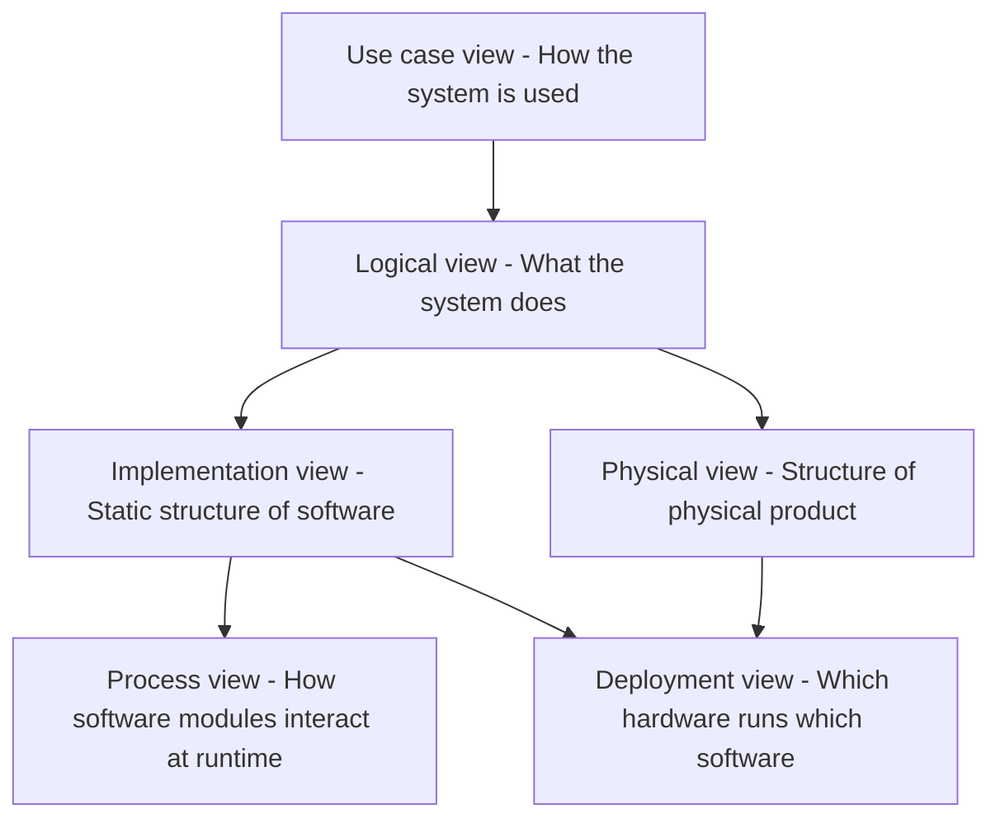

# Six views rendered from SysML v2 models

> **Status: implemented.** `ortho` renders these six views — see
> [README.md](README.md) for the CLI and [examples/](examples/) for two worked
> models, each carrying one file per view. Realization is the one relation
> defined below that no view yet draws.

## Background

The view model is based on Kruchten's 4+1 architectural view with two changes. First, his Physical View is split into Physical and Deployment. Kruchten named the software-onto-nodes mapping "Physical" when the only physical thing worth drawing was which box a process ran on. A mechatronic product needs that name for the product itself, so the mapping view takes the name it is usually given anyway, and Physical describes mechanics, electronics, cabling and computers.

Second, Kruchten's Logical View is the structure that delivers functionality — classes, then blocks. Here it is the functions themselves, medium-independent, with the components that realize them pushed down into Implementation and Physical.

## The six views

The six views we have chosen are the following: Use case view, Logical view, Implementation view, Physical view, Deployment view, and Process view. When developing a new product you should start with the customer needs and what problem to solve. Hence you start with the Use case view. Then you can continue sorting the needs into logical functions. These logical functions are realized in software (Implementation view), hardware (Physical view), or both. How software is deployed on hardware is shown in the Deployment view. Finally, the Process view shows how software modules interact at runtime.

### Use case view

How the system is used, and by whom. Says nothing about how anything works — no realization detail reaches this view.

**Rendering.** A use case diagram. Actors are stick figures placed outside a plain rectangle that carries the subject's name; use cases are ellipses inside it. Primary actors — those declared on a use case def, and so shared by every use case of that kind — stand on the left; a secondary actor, added on a single use case (someone the system acts on rather than a user of it), stands on the right. Actor-to-use-case associations are solid, undecorated straight lines. An `include` is a dashed line with an open arrowhead, labelled «include», pointing at the included use case.

### Logical view

What the system does, as a hierarchy of functions, independent of medium. Says nothing about what performs a function.

Functions outlive their realizations — arming a mechanism can be a mechanical hatch, a relay driven by software, or pure software: one function, three media, three decades. But neutrality is not uniform:

- **Control functions migrate between media** — arming, interlocking,
  sequencing, regulating. Cams became relays became firmware, and will move
  again. These are what the insulation is for.
- **Energy and material functions do not** — containing a volume, raising a
  temperature. Medium-bound for physical reasons.

Realization is many to many — one function can be realized by software and hardware together, a relay plus its driver, and one function may have several realizations across product variants. A function exists exactly once here; the elements that realize it live on the Implementation and Physical views, and say so themselves: each names the functions it performs, so this view never names them back. A function nothing performs is a gap, and the diagrams show it by omission.

**Rendering.** A work-breakdown chart of rounded rectangles, one box per function. Every function has exactly one parent, so the decomposition is strictly a tree: each parent stands over its family, directly above the middle child when there is one, and a single stem drops to a line that feeds every child, with no arrowheads. The lowest level of each branch is listed vertically beneath its parent, off a spine, so a broad tree keeps a page's proportions instead of stretching into one long row. A function shared by several branches sits at their lowest common ancestor rather than being duplicated, so its position states how widely it is shared.

### Implementation view

Static structure of the software: modules and their dependencies. Runtime
behaviour belongs to Process, hardware to Physical.

**Rendering.** Packages are rectangles with a small tab in the top-left corner, nested to show containment. Modules — the part defs a package declares — are plain rectangles inside it carrying a name compartment; a package-level part usage is an instance, not a module, and is not drawn. Dependencies are drawn between packages, read from their imports: dashed lines with an open arrowhead, labelled «import», pointing at the package depended upon. A module that realizes functions carries them in a *perform actions* compartment, so the view also says what each module is for. Its API is drawn as a *ports* compartment listing what it offers and, conjugated with `~`, what it needs. No lines are drawn between modules — where they publish and subscribe rather than call, as containers on a middleware do, a line would claim a coupling that does not exist; what actually flows is the Process view's business.

### Physical view

Structure of the physical product — mechanics, electronics, cabling and
computers, and how they connect.

**Topology, not geometry.** What connects, mounts and wires to what.
Dimensions, placement and enclosure layout are out of scope. A cable is a
`connect`, not a part, so it carries no properties of its own.

**Rendering.** An internal block diagram of the product. Each part *in the product* is a rectangle headed `name : Type`, with its multiplicity where it has one, nested inside the part that contains it — so assembly containment is shown by nesting, and a type fitted twice appears as two boxes, each wired on its own. No attributes are shown: the view is about what connects to what, not about specification values. Ports are small squares sitting on the border, labelled just outside the box. Cables, pipes and looms are plain solid lines drawn port to port, with no arrowhead — direction belongs to the ports, not to the line. A connection typed by an `interface def` carries the interface name as a label on the line. A part that realizes functions lists them in a *perform actions* compartment, its own and its definition's alike, so the view says what each piece of hardware is there to do.

### Deployment view

Which hardware runs which software. The only view whose content is a relation rather than a set of elements: its nodes are borrowed from Implementation and Physical, and the mapping is the whole subject — drawn as containment rather than as an edge.

Narrower than realization — this is the sub-case where the realization happens to be software and therefore needs a host.

**Rendering.** Hardware nodes are drawn as three-dimensional boxes — a rectangle with a shallow depth edge along its top and right. The software they host is drawn as plain rectangles nested inside them, and the nodes in turn sit inside a frame for the device they are fitted in — the aircraft's boards together, the handheld on its own — so which programs run where reads at a glance. Nesting replaces arrows entirely — there is no allocation edge to follow, and a node with nothing drawn inside it visibly hosts nothing. Boxes are packed into rows rather than lined up, so the view keeps a page's proportions. This deliberately replaces the earlier allocation diagram, which kept the boxes apart and joined them with dashed arrows.

### Process view

How software modules interact at runtime, for one scenario. One scenario per diagram; structure belongs to the other views, and hardware dynamics are out of scope.

**Rendering.** A sequence diagram. Each module is a rectangle across the top with a dashed vertical lifeline hanging beneath it, and a narrow activation bar drawn on the lifeline while the module is active. A person taking part — an untyped lifeline, or one typed as an actor — is a stick figure instead of a rectangle. Messages are solid horizontal arrows with a filled arrowhead, ordered top to bottom and labelled with the message name and its payload. A message a module sends to itself loops back to the same lifeline.

## Summary

| View | Description | SysML v2 |
| --- | --- | --- |
| **Use case** | How the system is used, and by whom | `use case def`, `use case`, `actor`, `subject`, `include` |
| **Logical** | What the system does, as a hierarchy of functions | `action def`, `action` |
| **Implementation** | Static structure of the software | `package`, `private import`, `part def`, `part`, `perform`, `port def`, `port` |
| **Physical** | Structure of the physical product, as topology | `part def`, `part`, `port def`, `port`, `connect`, `interface def`, `perform` |
| **Deployment** | Which hardware runs which software | `part`, `allocate` |
| **Process** | How software modules interact at runtime | `action def`, `part`, `message`, `then`, `attribute def` |

All six views are expressible in the grammar today, and
[LANGUAGE.md](LANGUAGE.md) sets out the exact subset, view by view. The
relation between them is expressible too: a component states the functions it
realizes with `perform` (§7.17.6), and the Implementation and Physical views
draw it as the spec's *perform actions* compartment — so the link from
Logical to what realizes it needs no view of its own.

## References

- Philippe Kruchten, "Architectural Blueprints — The 4+1 View Model of
  Software Architecture", *IEEE Software* 12 (6), pp. 42–50, November 1995.
  The origin of the four views plus scenarios that this document adapts.
- [OMG Systems Modeling Language (SysML)](https://www.omg.org/spec/SysML/) —
  the specification the grammar is written against.
- [SysML v2 Release](https://github.com/Systems-Modeling/SysML-v2-Release) —
  the public repository for the v2 language specification, textual notation
  and pilot implementation.
